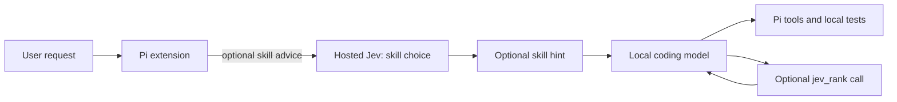

# pi-jev

Speed-focused [Pi](https://pi.dev) extension combining a local coding model with hosted [TypeSafe Jev](https://docs.typesafe.ai/concepts/how-to-build-with-system-one) judgments. File retrieval reduces context sent to the generator; exact-result caching and an outage cooldown bound repeated network overhead. Qwen, DeepSeek, and other generators continue to write code and use Pi's tools.

**This does not accelerate model inference.** It targets end-to-end latency by retrieving focused excerpts and avoiding redundant hosted calls. Every uncached Jev call adds latency. Reading small files directly is often cheaper. See the retained positive and negative measurements in [VALIDATION.md](VALIDATION.md).

## Install into Pi

`pi-jev` is a Pi package that exposes one extension (`./src/index.ts`). Full instructions live in [docs/install.md](docs/install.md).

```sh
npm ci                              # install test/benchmark dependencies

# Try it for one session, nothing written to settings:
pi -e ./src/index.ts --model opencode-go/deepseek-v4.1-flash

# Register this checkout persistently (global settings):
pi install "$(pwd)"

# Or for one project only (writes .pi/settings.json):
pi install -l /absolute/path/to/pi-jev

# From git, pinned to a tag or commit:
pi install git:github.com/madeye/pi-jev@v0.1.0
```

Verify and manage the install with `pi list`, `pi config` (enable/disable resources),
`pi update --extensions`, and `pi remove <source>`. Inside a session, `/jev status`
shows whether the extension is active. The hosted key is read from the environment at
load time: `export TYPESAFE_API_KEY=...`. Without it `jev_search` still works using local
retrieval, and `--jev-speed`/`--jev-skills`/`--jev-tools` stay disabled.

## Run

Requires Node 22+ and `@earendil-works/pi-coding-agent` 0.85.1. The current package pins compatibility to the 0.85 series; older `@mariozechner` Pi releases are not tested. Install it first as described in [Install into Pi](#install-into-pi).

```sh
# Set TYPESAFE_API_KEY in your shell, then:
pi -e ./src/index.ts --model opencode-go/deepseek-v4.1-flash
```

The workspace default model is `opencode-go/deepseek-v4.1-flash` (set as `defaultProvider`/`defaultModel` in `~/.pi/agent/settings.json`), so `--model` can be omitted. Pass `--model provider/id` to use a different configured model. The extension does not configure, download, or switch models.

- `/jev status`: show enabled state, evaluation attempts, cache hits, failures, Jev latency, input tokens, and suggestions for this extension instance.
- `/jev off`: stop sending new requests to Jev.
- `/jev on`: enable assistance when a key is configured.
- `/jev find <question> -- <path>`: return ranked source excerpts directly, without starting a local-model turn. Use a JSON array after `--` for multiple paths.

For quick evidence lookup in the interactive Pi session:

```text
/jev find What command runs the tests? -- README.md
/jev find How are retries handled? -- ["docs/network.md", "src/client.ts"]
```

This fast path returns excerpts, not a synthesized answer. It also works without a Jev key using local retrieval. For headless use, select `--mode json` to receive the `jev-find` custom-message event; Pi's text print mode only prints assistant responses, so it does not print this command's result.

Loading the extension with `TYPESAFE_API_KEY` set enables hosted ranking when its tools are called. There is no automatic request before model generation by default. Without a key, `jev_search` still performs local retrieval. Standard `HTTP_PROXY`, `HTTPS_PROXY`, and `NO_PROXY` variables (and lowercase forms) are honored for Jev without altering Pi's global networking.

## Experimental adaptive thinking

`pi -e ./src/index.ts --jev-speed --model local-qwen/qwen3.8-27b` enables an experimental speed route. Jev classifies the current request once before generation with a 3-second deadline (retrieval retains 1.5 seconds). A confident routine-task judgment sets `chat_template_kwargs.enable_thinking=false` on that turn's Qwen requests. Complex or ambiguous requests, images, oversized prompts, uncertain judgments, and service failures preserve the original payload. This adds a hosted request, so its net benefit must be measured.

This switch is limited to Qwen3-family models (excluding Coder) using `openai-completions` on localhost, `.local`, or private IPv4 endpoints. Existing explicit reasoning/template parameters take precedence. Messages, tools, sampling parameters, model selection, and global Pi thinking settings are unchanged. Routing resets for each user turn and on completion, model changes, session changes, or `/jev off`.

Why this exists: retained Qwen runs emitted substantial thinking tokens despite Pi's `--thinking off`. The [Qwen model card](https://huggingface.co/Qwen/Qwen3.8-27B) documents a per-request template switch. The plugin's actual Pi-to-HTTP payload is tested; effectiveness and end-to-end speed on the configured Qwen server remain unverified. Keep this opt-in until a direct-connection benchmark succeeds.

## What it does

1. **Optional skill suggestion:** enable with `--jev-skills` to have Pi's `before_agent_start` hook send the current prompt and loaded skill names/descriptions to Jev in one Choice request. A confident match adds a short optional hint for that turn. `none`, uncertainty, missing credentials, or service failure leaves the prompt unchanged. This is off by default because its latency benefit is unproven. It never runs a skill by itself.
2. **File retrieval:** `jev_search` takes a question and 1–16 known file paths. It reads bounded text files locally, selects up to 12 excerpts by word overlap, then asks Jev to prioritize direct evidence. The model receives three excerpts by default with exact text, file paths, and line numbers, without generating tool arguments that repeat file contents. A hosted failure or `/jev off` retains local retrieval. Results explicitly report omissions and unreadable inputs; retrieval is partial and does not replace reading complete files before editing.
3. **Evidence ranking:** the `jev_rank` tool takes a question and up to 24 candidate passages. One batched request scores their relevance. Confident direct evidence moves first; all other passages keep their relative order. Every passage is returned verbatim. Prefer `jev_search` when evidence lives in files, avoiding the cost of copying passages into arguments.
4. **Bounded failure:** a 1.5-second deadline, no automatic retries, strict response validation, cancellation, and a 24 KB serialized-request limit. A failed ranking returns the original passages and an explicit failure status. Session changes invalidate pending skill advice.
5. **Built-in tool output (opt-in):** `--jev-tools` adds a `tool_result` hook for Pi's `grep`, `find`, `ls`, and `bash`. Text output of at least 4 KB is split into the same 12-line/800-byte excerpts, 12 are shortlisted by word overlap with the current user prompt and tool input, and Jev scores them. Only excerpts meeting the direct-evidence threshold (up to six) plus the final excerpt — exit summaries and Pi's own truncation notice — are kept, in original order, with `[jev: lines a-b omitted]` markers and a closing notice. When instead **every** shortlisted excerpt is confidently unrelated (score < 0.5, confidence ≥ 0.8), the output is withheld: only its first and final excerpts and a notice remain. `bash` output is withheld only for inspection pipelines (`cat`, `grep`, `git log`, …, without redirects or substitutions), so side-effect reports are never hidden. The original output passes through unchanged when the judgments are mixed or uncertain, Jev fails or is off, the result is an error, contains images, the turn has no text prompt, or the saving is under 30%. Repeating the identical tool call returns the complete output once. `read`, `edit`, and `write` results are never altered. `/jev status` reports `focusedResults`/`focusedBytesSaved` and `withheldResults`/`withheldBytes`. With the flag on, a non-blocking `HEAD` request carrying no credentials or content opens the Jev connection at the start of each turn. Off by default: each qualifying result adds a hosted request with a 3-second deadline. The retained runs cut input tokens by 55% overall (86–89% when every Jev call returned) but increased wall time against a fast hosted generator; see [VALIDATION.md](VALIDATION.md).
6. **Avoid repeated overhead:** successful identical requests are cached for 60 seconds in a 32-entry in-memory LRU. The key includes the model, full supplied state, and questions; changed file excerpts trigger new judgments. Cached results are copied before returning and do not double-count hosted tokens. After two consecutive service failures, requests use fallback for 30 seconds (`circuit-open`); valid cached results remain available. A successful fresh request resets the failure count. Nothing is cached on disk.



The current policy uses Choice confidence ≥ 0.8 for skill advice; passage promotion requires Score confidence ≥ 0.8 and score ≥ 1.5 on a 0–2 rubric. These are **untuned experimental defaults**, not correctness probabilities or universal thresholds. The model is pinned to `jev-1.13.0` so the policy does not silently change with an alias update.

## Data and limits

Automatic skill advice sends the current prompt and eligible skill names/descriptions. It does not send skill file bodies, local skill paths, conversation history, system instructions, or repository files. Explicit skill invocations, image prompts, prompts longer than 8,000 characters, and catalogs larger than 64 eligible skills skip advice rather than silently truncating evidence. Skills marked `disableModelInvocation` are excluded.

Calling `jev_rank` sends the question and supplied passage IDs/text, which may contain code. Hybrid mode therefore is not an offline/private-local-only workflow. The client never prints keys or remote error bodies. Runtime metrics stay in memory; ordinary Pi tool/session recording still applies to tool arguments and results. Switching off prevents future requests; it cannot recall an already transmitted request.

Calling `jev_search` while enabled sends the question and shortlisted file excerpts to Jev; source paths remain local. Only explicitly supplied files are opened, relative to Pi's current directory (absolute paths are also supported). Each file must be regular UTF-8 text of at most 256 KB. Excerpts contain up to 12 lines and 800 bytes; longer individual lines are skipped with a warning. The tool returns up to `limit` excerpts (1–12, default 3), with counts for indexed, shortlisted, and omitted excerpts. Lexical shortlisting can miss synonyms, cross-file relationships, and relevant text outside the shortlist. Use `read` or refine the query when coverage matters. No history or existing tool output is pruned.

With `--jev-tools`, the current prompt (first 2,000 characters), the model's latest message text (last 500 characters), the tool name and input (first 500 characters), and up to 12 shortlisted output excerpts are sent to Jev. Command output can contain secrets or private paths; leave the flag off where that matters. Judgments are relative to the latest user prompt, so evidence relevant only to an earlier turn or to the model's own intermediate goal can be omitted; the repeat-call escape hatch exists for that case.

Jev's documented limitations include indirection, numerical reasoning, adversarial text, and irrelevant context. It is not a code verifier or authorization mechanism. Tests, type checking, and compilers remain the validation tools. Existing context and tool access are preserved; this first version does not prune history, compress code, switch reasoning levels, route models, or automatically retry generated solutions.

## Validate and measure

```sh
npm run lint
npm test
npm run eval:live       # Six hosted requests using synthetic inputs
npm run eval:speed      # Six synthetic adaptive-routing requests
npm run bench:local     # Ten local Pi runs, five with Jev advice
npm run bench:retrieval # Eighteen Pi runs: read vs local retrieval vs Jev retrieval
npm run bench:coding    # Eight Pi runs: two coding tasks, two modes, two repetitions
npm run bench:tps       # Throughput: context size, tool calls, TTFT and decode tok/s (also bash vs --jev-tools)
npm run bench:cache     # Hosted request versus exact in-memory replay
npm run bench:direct    # Reuses the completed large-document benchmark fixture
```

Every benchmark passes `--model` explicitly, so it is independent of your Pi `defaultProvider`/`defaultModel`. The generator defaults to the local `local-qwen/qwen3.8-27b`; override it with `PI_BENCH_MODEL=provider/model`. Reports go under ignored `results/`; no secrets are written by the evaluation scripts. The local benchmark alternates pair order, includes process startup and Jev latency, records tokens and exact-match answers, and uses the same decision helper to add a skill hint. It isolates skill selection rather than invoking the full plugin hook. It is a five-case smoke benchmark, not proof of improved coding quality. Server settings may override Pi's requested `thinking=off`.

For a meaningful follow-up, freeze a separate set of real coding tasks and checkouts, compare plain Pi, skill advice, and evidence ranking separately, then repeat on the same hardware/model/quantization with controlled cache state. Record passing project tests, task completion rate, tool/retry counts, input/output tokens, Jev failures/cost, and median/p95 wall time. Tune thresholds on separate development tasks. Keep negative results: fewer tokens alone is not success, and faster wrong answers do not count.

See [VALIDATION.md](VALIDATION.md) for the observed local results and their limits.

The retrieval benchmark exercises the actual extension with a frozen synthetic guide and three questions, repeated twice with rotated mode order. It includes an archived/current distinction and an unknown-answer case. Raw Pi events and a report are written under `results/`. Set `PI_BENCH_REPEATS` (1–10) to change repetitions. This isolates retrieval behavior; it does not establish performance on real coding tasks.

Use `PI_BENCH_PADDING=64 npm run bench:retrieval` to repeat the comparison with a larger document. The original questions and policy passages stay fixed; 64 irrelevant design notes increase full-file context. This writes separate `results/retrieval-large-*` artifacts. `bench:cache` uses a 5-second diagnostic deadline to separate cache behavior from cold TLS failures; the plugin keeps its 1.5-second default.

The coding benchmark generates implementations in temporary directories from frozen policies, then checks them in an independent Node process with assertions that were not present during generation. It covers retry delays and cache expiry, including invalid input and archived policy distractors. Generated code and event streams are retained under `results/`. It compares full-file reads with Jev retrieval, allowing ordinary reads in both modes. Run benchmarks sequentially to avoid competing for the same model server.

`PI_BENCH_SPEED=1 npm run bench:coding` instead compares identical prompts and tool sets with adaptive thinking off/on. It records the actual per-request template switches and reported reasoning tokens under `results/speed-*`, separately from retrieval results. A mock-provider integration test checks the same Pi HTTP path after removing deliberately unusable proxy settings; it is not an inference benchmark.

The throughput benchmark (`npm run bench:tps`) directly tests the speed hypothesis: whether Jev raises end-to-end tokens per second by compressing the context the generator must prefill or by cutting tool round trips. Each task needs facts scattered across several large, padded files with archived distractors. The `read` mode reads full files; the `local` and `jev` modes call `jev_search` with all paths and a higher excerpt limit, with `local` using only on-device ranking and `jev` adding the hosted judgment. An observer extension records per-request input/output tokens, time to first token (prefill) and decode time, while the report aggregates effective TPS (`output / request wall time`), decode TPS (`output / decode time`), median and p95 input tokens, tool executions, and end-to-end wall time. Answers are checked against the frozen current values, so a faster wrong answer fails the run. `PI_BENCH_MODES=bash,focus` instead compares identical `bash`-only prompts without and with `--jev-tools`, counting focused results as hosted successes. Set `PI_BENCH_MODES=read` for a keyless baseline, `PI_BENCH_MODES=read,local` for keyless retrieval, `PI_BENCH_MODES=jev` for a Jev-only run, and `PI_BENCH_SPEED=1` to add adaptive non-thinking routing to the Jev mode (`results/tps-speed-*`). Because a single machine run has uncontrolled server cache state, treat it as evidence for or against the hypothesis rather than proof.

## Design references

- [TypeSafe building guide](https://docs.typesafe.ai/concepts/how-to-build-with-system-one): keep workflow control in code, ask narrow typed questions.
- [Skill suggestion cookbook](https://docs.typesafe.ai/cookbooks/skill_suggestion): relevant design precedent; this prototype uses one bounded Choice request rather than its two-stage catalog search.
- [Re-ranking cookbook](https://docs.typesafe.ai/cookbooks/rerank_typesafe), [confidence](https://docs.typesafe.ai/confidence), and [model limitations](https://docs.typesafe.ai/model-jaggedness/jev-1.13).
- [HTTP API](https://docs.typesafe.ai/api), [model IDs and limits](https://docs.typesafe.ai/models), and [Pi extensions](https://pi.dev/docs/latest/extensions).
